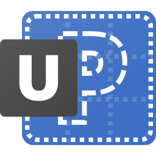

**Project Status:** The project is currently in the development phase and certain features have not yet been completed.

**项目状态:** 该项目目前还处于开发阶段，某些功能尚未完成。

<h1 align="center">
  <br>
  
  <br>
  UI-PROTOTYPE
  <br>
</h1>

A clean, fully keyboard-enabled, feature-rich UI prototype designed specifically for Electron.

一个简洁的、完整键盘支持、功能丰富的专为 Electron 设计的 UI 原型 。

[](https://github.com/JonnyJong/UI-PROTOTYPE/actions)

## Quick start / 快速开始
```sh
npm install
npm run compile
npm start
```

## Document / 文档
- [中文](./docs/zh/Index.md)
