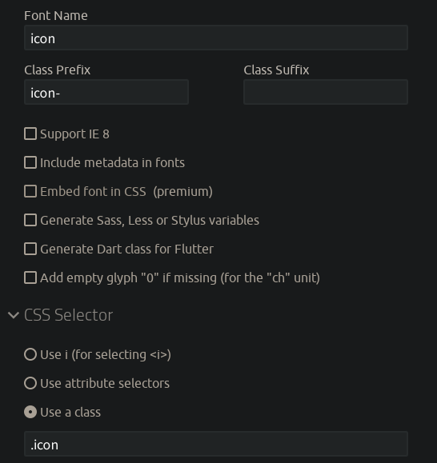

# 图标
UI-PROTOTYPE 内置了 [Segoe Fluent Icons](https://learn.microsoft.com/en-us/windows/apps/design/style/segoe-ui-symbol-font)。

## 查询图标名
访问[https://learn.microsoft.com/en-us/windows/apps/design/style/segoe-ui-symbol-font](https://learn.microsoft.com/en-us/windows/apps/design/style/segoe-ui-symbol-font#pua-e700-e900)，`Description`列即为图标名。

若使用 Windows 10 或 Windows 11 系统，可以安装 [WinUI 3 Gallery](https://apps.microsoft.com/detail/9p3jfpwwdzrc)，在 “Design guidance” > “Icons” 中查找。

## 使用图标
```pug
.icon.icon-IconName
```
```html
<div class="icon icon-IconName"></div>
```
将`IconName`替换为图标名即为具体图标。

## 添加 SVG 图标
1. 下载 SVG 图标文件
2. 打开[IcoMoon App](https://icomoon.io/app/#/select)
3. 打开默认图标集`IcoMoon - Free`的菜单，点击“Remove Set”以删除默认图标集
4. 拖入 SVG 图标文件
5. 切换页面上方模式为“Select”，单击选中新增的图标
6. 点击新图标集`Untitled Set`的菜单，点击“Properties”，再点击“Edit Metadata”设置元信息
7. 在页面下方切换到“Generate Font”
8. 点击齿轮按钮，修改图标信息
   推荐设置：
9. 修改图标名和图标 Unicode，推荐 Unicode 编码大于等于`f8b4`
10. 点击页面下方“Download”按钮下载图标包
11. 将图标包中`fonts/icon.woff`和`style.css`文件复制到项目中并引入

重复 1、4、5、9 步骤可添加多个图标。

## 其他
### 免费图标库

- [Material Symbols and Icons - Google Fonts](https://fonts.google.com/icons)
- [@mdui/icons 图标组件库](https://www.mdui.org/docs/2/libraries/icons)
- [Fluenticons](https://fluenticons.co)
