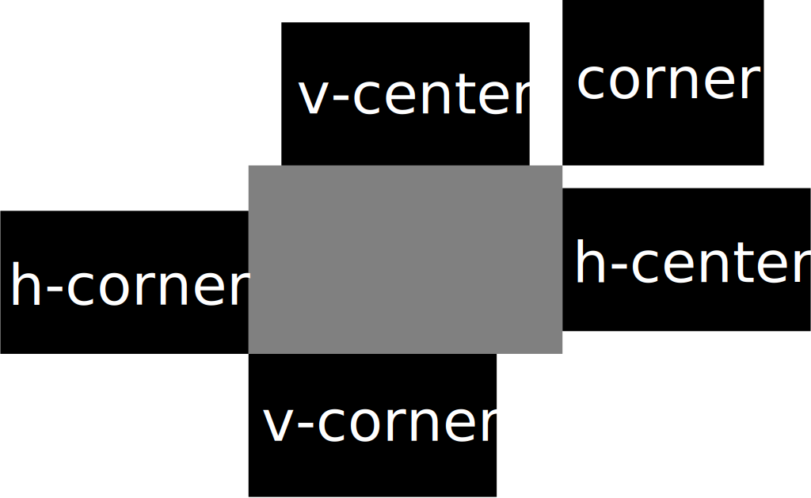

# 工具
UI-PROTOTYPE 提供了一些常用的工具，所有工具均位于 `src/shared/utils` 中。

## API

### dom
提供更简便的 DOM 操作方法。

#### 类：`Dom`
一个类似 JQ 的 DOM 操作类。
```typescript
class Dom<T extends HTMLElement = HTMLElement> {
  constructor(...args: (string | T | Dom<T>)[]);
}
```
接受任意数量的参数，每个参数可以是字符串、DOM 元素或 Dom 实例。  
`string` 类型的参数将作为函数 `document.querySelectorAll` 的参数，查询结果将存入 Dom 实例中。  
可简写为 [`$()`](#_2)。

##### 静态函数：`pug`
```typescript
function pug<T extends HTMLElement = HTMLElement>(
  pug: string,
  options?: any
): Dom<T>;
```
使用 pug 模板引擎编译 pug 字符串，并返回一个 Dom 实例。

##### 静态函数：`html`
```typescript
function html<T extends HTMLElement = HTMLElement>(html: string): Dom<T>;
```
将 HTML 字符串转换为 Dom 实例。

##### 静态函数：`layout`
```typescript
function layout<T extends HTMLElement = HTMLElement>(
  name: string,
  options?: any,
  shared: boolean = false
): Dom<T>;
```
使用 pug 模板引擎编译 pug 模板文件，并返回一个 Dom 实例。

##### 静态函数：`from`
```typescript
function from<T extends HTMLElement = HTMLElement>(
  ...args: (string | T | Dom<T>)[]
): Dom<T>;
```
将任意数量的参数转换为 Dom 实例。  
`string` 类型的参数将作为 HTML 字符串创建为 HTMLElement 元素。

##### 静态函数：`new`
```typescript
function new<K extends keyof DOMTagNameMap>(
  tagName: K,
  pack?: false
): DOMTagNameMap[K];
function new<K extends keyof DOMTagNameMap>(
  tagName: K,
  pack: true
): Dom<DOMTagNameMap[K]>;
function new<K extends keyof DOMTagNameMap>(
  tagName: K,
  pack: boolean = false
): DOMTagNameMap[K] | Dom<DOMTagNameMap[K]>;
```
创建一个 DOM 元素。  
`pack` 参数决定是否包装为 Dom 实例，默认 `false`。

##### 方法：`filter`
```typescript
function filter(callback: (value: T, index: number, array: T[]) => boolean): Dom<T>;
```
使用回调函数过滤出新的 DOM 实例。

##### 方法：`query`
```typescript
function query<T extends HTMLElement = HTMLElement>(selector: string): Dom<T>;
```
使用 CSS 选择器在当前 Dom 实例中的所有元素查询 DOM 元素，并返回新的 Dom 实例。

##### 方法：`map`
```typescript
function map(callback: (value: T, index: number, array: T[]) => T): Dom<T>;
```
使用回调函数遍历当前 Dom 实例中的所有元素，并返回新的 Dom 实例。

##### 方法：`clone`
```typescript
function clone(deep?: boolean): Dom<T>;
```
克隆当前 Dom 实例中的所有元素，并返回新的 Dom 实例。
`deep` 参数决定是否深度克隆，默认 `false`。

##### 方法：`at`
```typescript
function at(i: number): T;
```
返回当前 Dom 实例中的第 `i` 个元素。

##### 方法：`forEach`
```typescript
function forEach(callback: (value: T, index: number, array: T[]) => void): void;
```
使用回调函数遍历当前 Dom 实例中的所有元素。

##### 方法：`every`
```typescript
function every(callback: (value: T, index: number, array: T[]) => boolean): boolean;
```
使用回调函数判断当前 Dom 实例中的所有元素是否都符合条件。

##### 方法：`any`
```typescript
function any(callback: (value: T, index: number, array: T[]) => boolean): boolean;
```
使用回调函数判断当前 Dom 实例中的所有元素是否至少有一个符合条件。

##### 方法：`before`
```typescript
function before(...args: (Dom | HTMLElement | string)[]): void;
```
在当前 Dom 实例中的所有元素之前插入新的元素。

##### 方法：`prepend`
```typescript
function prepend(...args: (Dom | HTMLElement | string)[]): void;
```
在当前 Dom 实例中的所有元素的第一个子节点之前插入新的元素。

##### 方法：`append`
```typescript
function append(...args: (Dom | HTMLElement | string)[]): void;
```
在当前 Dom 实例中的所有元素的最后一个子节点之后插入新的元素。

##### 方法：`after`
```typescript
function after(...args: (Dom | HTMLElement | string)[]): void;
```
在当前 Dom 实例中的所有元素之后插入新的元素。

##### 方法：`on`
```typescript
function on<K extends keyof HTMLElementEventMap>(
  type: K,
  listener: (this: HTMLElement, ev: HTMLElementEventMap[K]) => any,
  options?: boolean | AddEventListenerOptions
): void;
function on(
  type: string,
  listener: EventListenerOrEventListenerObject,
  options?: boolean | AddEventListenerOptions
): void;
```
在当前 Dom 实例中的所有元素上添加事件监听器。

##### 方法：`off`
```typescript
function off<K extends keyof HTMLElementEventMap>(
  type: K,
  listener: (this: HTMLElement, ev: HTMLElementEventMap[K]) => any,
  options?: boolean | EventListenerOptions
): void;
function off(
  type: string,
  listener: EventListenerOrEventListenerObject,
  options?: boolean | EventListenerOptions
): void;
```
在当前 Dom 实例中的所有元素上移除事件监听器。

##### 方法：`push`
```typescript
function push(...doms: (T | Dom<T>)[]): void;
```
向当前 Dom 实例添加新的元素。

##### 方法：`remove`
```typescript
function remove(...doms: (T | Dom<T> | number)[]): void;
```
从当前 Dom 实例中移除元素。

##### 属性：`children`
```typescript
type children = Dom<HTMLElement>;
```
只读属性，返回当前 Dom 实例中的所有子元素组成的 Dom 实例。

##### 属性：`class`
```typescript
type class = IDomClass<T extends HTMLElement = HTMLElement>;
```
只读属性，返回用于管理 Dom 实例中所有元素类名的接口 [`IDomClass`](#idomclass)。

##### 属性：`attr`
```typescript
type attr = IDomAttribute<T extends HTMLElement = HTMLElement>;
```
只读属性，返回用于管理 Dom 实例中所有元素属性的接口 [`IDomAttribute`](#idomattribute)。

##### 属性：`length`
```typescript
type length = number;
```
只读属性，返回当前 Dom 实例中的元素数量。

##### 属性：`rect`
```typescript
type rect = DOMRect[];
```
只读属性，返回当前 Dom 实例中的所有元素的 DOMRect 对象。

##### 属性：`data`
```typescript
type data = { [key: string]: string };
```
只读属性，返回用于修改当前 Dom 实例中的所有元素数据属性的对象。  
*注意：该对象的 get 方法不稳定。*

使用示例：
```typescript
let dom = new Dom('body');
// 设置元素数据属性
dom.data.name = 'test';
// 获取第一个元素的数据属性（不稳定）
let name = dom.data.name;
// 删除元素数据属性
delete dom.data.name;
// 检查是否有元素数据属性
let hasName = 'name' in dom.data;
```

##### 属性：`style`
```typescript
type style = CSSTokens;
```
只读属性，返回用于修改当前 Dom 实例中的所有元素样式属性的对象。  
*注意：该对象的 get 方法不稳定；部分行为与 CSSStyleDeclaration 对象不同。*

使用示例：
```typescript
let dom = new Dom('body');
// 设置元素样式属性
dom.style.color = 'red';
// 获取第一个元素的样式属性（不稳定）
let color = dom.style.color;
// 删除元素样式属性
delete dom.style.color;
// 检查是否有元素样式属性
let hasColor = 'color' in dom.style;

// 设置元素样式变量
dom.style['--color'] = 'red';
// 获取第一个元素的样式变量（不稳定）
color = dom.style.['--color'];
// 删除元素样式变量
delete dom.style.['--color'];
// 检查是否有元素样式变量
hasColor = '--color' in dom.style;
```

##### 属性：`doms`
```typescript
type doms = Array<T extends HTMLElement = HTMLElement>;
```
只读属性，返回当前 Dom 实例中的所有元素。

##### 属性：`id`
```typescript
type id = string;
```
*注意：不稳定。*  
获取当前 Dom 实例中的第一个元素的 ID。
修改当前 Dom 实例中的所有元素的 ID。

#### 函数：`$`
```typescript
function $<T extends HTMLElement = HTMLElement>(
  ...args: (string | T | Dom<T>)[]
): Dom<T>;
```
接受任意数量的参数，每个参数可以是字符串、DOM 元素或 Dom 实例。  
`string` 类型的参数将作为函数 `document.querySelectorAll` 的参数，查询结果将存入 Dom 实例中。  
该函数为 [`new Dom()`](#dom_1) 简写。

除此之外，还有其他简写：

| 简写函数   | 原函数                  |
| ---------- | ----------------------- |
| `$.pug`    | [`Dom.pug`](#pug)       |
| `$.html`   | [`Dom.html`](#html)     |
| `$.layout` | [`Dom.layout`](#layout) |
| `$.from`   | [`Dom.from`](#from)     |
| `$.new`    | [`Dom.new`](#new)       |

#### 接口：`IDomClass`
该接口类似于 `DOMTokenList`，但是只有方法可以使用。

##### 方法：`add`
```typescript
function add(...args: string[]): void;
```
添加一个或多个类名到当前 Dom 实例中的所有元素。

##### 方法：`contains`
```typescript
function contains(name: string): boolean;
```
检查当前 Dom 实例中的所有元素是否包含指定类名。

##### 方法：`remove`
```typescript
function remove(...args: string[]): void;
```
移除一个或多个类名到当前 Dom 实例中的所有元素。

##### 方法：`replace`
```typescript
function replace(name: string, newName: string): void;
```
替换当前 Dom 实例中的所有元素的指定类名。

##### 方法：`toggle`
```typescript
function toggle(name: string, force?: boolean): void;
```
切换当前 Dom 实例中的所有元素的指定类名。

##### 方法：`setClassText`
```typescript
function setClassText(text: string): void;
```
直接设置当前 Dom 实例中的所有元素的类名。

#### 接口：`IDomAttribute`

##### 方法：`get`
```typescript
function get(name: string): (string | null)[];
```
获取当前 Dom 实例中的所有元素的指定属性。

##### 方法：`set`
```typescript
function set(name: string, value: string): void;
```
设置当前 Dom 实例中的所有元素的指定属性。

##### 方法：`remove`
```typescript
function remove(name: string): void;
```
移除当前 Dom 实例中的所有元素的指定属性。

### id
提供生成唯一 ID 的函数。

#### 函数：`unid`
```typescript
function unid(): string
```
根据时间和一个随机数，生成包含 26 位字母和数值的不定长的唯一 ID。

### math
提供额外的数学计算工具。

#### 函数：`range`
```typescript
function range(from: number, to: number, step: number = 1): number[];
```
生成一个包含指定范围内的所有数字的数组。

#### 函数：`clamp`
```typescript
function clamp(min: number, value: number, max: number): number;
```
限制一个数值在指定范围内。

### path
提供路径计算工具。

#### 函数：`distPath`
```typescript
function distPath(...path: string[]): string;
```
将相对路径转换为编译产物的绝对路径。

#### 函数：`pathNormalize`
```typescript
function pathNormalize(...path: string[]): string;
```
将路径转换为合法文件名。

### position
提供设置元素位置工具。

#### 函数：`setPosition`
```typescript
function setPosition(
  target: HTMLElement,
  size: Size,
  around: OutlineRect,
  align: Align = 'v-corner'
): Side;
```
设置元素的位置。  
若要调整显示安全区，请修改 `config/ui.json` 中的参数 `safetyZone`，顺序为“上、右、下、左”。

#### 函数：`getScaleFactor`
```typescript
function getScaleFactor(w: number, h: number, increment: number): number;
```
计算增加指定尺寸后，元素的缩放比例。

#### 类型：`Size`
```typescript
type Size = {
  width: number;
  height: number;
};
```
表示矩形大小的对象。

#### 类型：`OutlineRect`
```typescript
type OutlineRect = {
  top: number;
  right: number;
  bottom: number;
  left: number;
};
```
表示矩形外框大小、位置的对象。

#### 类型：`Align`
```typescript
type Side = {
  v: 'top' | 'bottom';
  h: 'left' | 'right';
};
```
表示对齐的边的位置的对象。只有角落对齐时，这些参数才有实际意义。  
`v` 为纵向对齐上或下边。  
`h` 为横向对齐左边或右边。

#### 类型：`Side`
```typescript
type Align =
  | 'corner'
  | 'h-corner'
  | 'v-corner'
  | 'h-center'
  | 'v-center';
```
表示对齐位置的对象。

| 值         | 说明     |
| ---------- | -------- |
| `corner`   | 角落     |
| `h-corner` | 横向角落 |
| `v-corner` | 纵向角落 |
| `h-center` | 横向中心 |
| `v-center` | 纵向中心 |



### timer
提供定时器工具。

#### 函数：`sleep`
```typescript
function sleep(ms: number = 0): Promise<void>;
```
返回一个 Promise 对象，在指定毫秒后兑现。

#### 函数：`frame`
```typescript
function frame(): Promise<void>;
```
返回一个 Promise 对象，当浏览器下次重绘时兑现。

### function
函数执行相关工具。

#### 函数：`run`
```typescript
function run<T = any, Args extends Array<any> = any[]>(
  fn: any,
  ...args: Args
): Promise<T | Error>;
```
异步地执行目标函数，且不会抛出错误。  
`args` 为尝试执行的函数的参数。

返回一个 `Promise` 对象。若函数成功执行，兑现值为函数返回值；若函数执行失败，兑现值为 `Error` 对象。

#### 函数：`runSequence`
```typescript
function runSequence(
  sequence: OperationSequence,
  ignoreError: boolean
): void;
```
依次执行任务队列，若发生错误，则停止执行。  
`sequence` 为需要执行的任务队列。  
`ignoreError` 为是否忽略错误，默认值 `false`。

#### 类型：`OperationNode`
```typescript
type OperationNode = Function | number;
```
当为 `Function` 时，表示一个函数。  
当为 `number` 时，表示一个延时时间。

#### 类型：`OperationSequence`
```typescript
type OperationSequence = OperationNode[];
```
包含数个任务节点 [`OperationNode`](#operationnode) 的任务队列。
